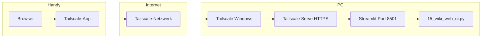

# DigiWiki – Einrichtung PC und Handy (von Anfang bis Ende)

Stand: Juni 2026 · Projektordner: `C:\Makroübungen\Digibest_Wiki_Projekt`

Diese Anleitung beschreibt die **komplette Einrichtung** für:

- **PC:** DigiWiki (Streamlit) starten und im Heimnetz nutzen
- **Handy:** DigiWiki von unterwegs über **Tailscale** erreichen

Ohne Tailscale funktioniert der Handy-Zugriff **nur im gleichen WLAN** (über die LAN-IP). Von zuhause/unterwegs brauchst du Tailscale.

---

## 1. Überblick – wie die Teile zusammenspielen



| Komponente | Aufgabe |
|------------|---------|
| **Streamlit** | Web-Oberfläche auf Port **8501** |
| **Tailscale** | Virtuelles privates Netz zwischen PC und Handy (100.x.x.x) |
| **Tailscale Serve** | Stabiler **HTTPS**-Zugang ohne `:8501` im Browser |
| **start.bat** | Startet alles: Cleanup, Tailscale, Streamlit, Browser |
| **digiwiki_helpers.ps1** | Hält Tailscale im Hintergrund stabil (unsichtbar) |

---

## 2. Software installieren (Downloads)

### Auf dem PC (Windows)

| Programm | Zweck | Download |
|----------|--------|----------|
| **Python 3.11+** | Laufzeit für DigiWiki | https://www.python.org/downloads/ |
| **Git** (optional) | Repository klonen | https://git-scm.com/download/win |
| **Tailscale** | Remote-Zugang Handy ↔ PC | https://tailscale.com/download/windows |
| **Microsoft Access ODBC** | CRM-Datenbank (falls genutzt) | Microsoft 365 / Access Runtime |

Bei Python-Installation: Haken setzen bei **„Add python.exe to PATH“**.

### Auf dem Handy (Android)

| App | Zweck | Download |
|-----|--------|----------|
| **Tailscale** | Verbindung zum PC | https://play.google.com/store/apps/details?id=com.tailscale.ipn |
| **Browser** (Firefox/Chrome) | DigiWiki öffnen | Play Store |

Alternativ Tailscale-Übersicht: https://tailscale.com/download

### Tailscale-Konto

1. Auf https://login.tailscale.com/start ein Konto anlegen (Google/Microsoft/E-Mail).
2. **Dasselbe Konto** auf PC **und** Handy anmelden.
3. Beide Geräte erscheinen dann im gleichen **Tailnet**.

---

## 3. DigiWiki auf dem PC einrichten

### 3.1 Projekt beschaffen

**Variante A – bereits vorhanden:** Ordner  
`C:\Makroübungen\Digibest_Wiki_Projekt`

**Variante B – aus GitHub:**

```powershell
cd C:\Makroübungen
git clone https://github.com/HansKohlhaas/DigiWiki.git Digibest_Wiki_Projekt
cd Digibest_Wiki_Projekt
```

### 3.2 Python-Umgebung (.venv)

Im Projektordner (PowerShell oder CMD):

```powershell
cd C:\Makroübungen\Digibest_Wiki_Projekt
python -m venv .venv
.venv\Scripts\python.exe -m pip install -U pip
```

Falls die `.venv` schon existiert und DigiWiki lokal lief: Schritt überspringen.

Wichtige Pakete (werden bei Bedarf nachinstalliert):

```powershell
.venv\Scripts\python.exe -m pip install streamlit python-dotenv langchain-google-genai langchain-chroma langchain-community langchain-classic openai pandas pyodbc docx2txt
```

### 3.3 API-Schlüssel (.env)

1. Datei `.env.example` nach `.env` kopieren.
2. Mindestens eintragen:
   - `GOOGLE_API_KEY` (Wiki / Gemini)
   - `OPENAI_API_KEY` (Mails / WhatsApp-Entwürfe)

```powershell
copy .env.example .env
notepad .env
```

Die `.env` wird **nicht** ins Git-Repository hochgeladen.

### 3.4 Weitere lokale Pfade (optional)

In `config.py` bzw. per Umgebungsvariablen in `.env`:

| Variable | Standard | Bedeutung |
|----------|----------|-----------|
| `DIGIWIKI_ACCESS_DB` | Access-Pfad | CRM-Datenbank |
| `DIGIWIKI_CHROMA_DB` | `./Chroma_DB` | Vektor-Datenbank |
| `DIGIWIKI_WATCH_ROOTS` | `C:\Eigene Projekte;C:\Verwaltung` | Wiki-Index-Ordner |

Chroma-DB und `wiki_stand.json` sind **lokal** und müssen auf dem PC existieren (nicht im Git).

---

## 4. Tailscale auf dem PC einrichten

### 4.1 Installation und Anmeldung

1. Tailscale für Windows installieren.
2. Mit dem **gleichen Konto** anmelden wie später auf dem Handy.
3. Im Tailscale-Menü (Taskleiste): Status **Connected** / verbunden.

### 4.2 Wichtige Einstellungen am PC

In der Tailscale-App (Rechtsklick → Preferences):

| Einstellung | Empfehlung |
|-------------|------------|
| **Run on startup** | Ein |
| **Use Tailscale DNS** | Ein (für MagicDNS) |
| **Exit Node / Use as VPN** | **Aus** (wenn kein Exit-Node genutzt wird) |

### 4.3 Automatische PC-Konfiguration durch DigiWiki

Beim Start von `start.bat` läuft automatisch `digiwiki_tailscale_fix.ps1`. Das Skript:

- startet den Tailscale-Dienst falls nötig
- richtet **Tailscale Serve** ein (HTTPS → `localhost:8501`)
- legt Firewall-Regeln für Port **8501** an
- setzt das Tailscale-Netzwerk auf „Privat“ (Firewall)

Manuell ausführen (Diagnose + Reparatur):

```powershell
cd C:\Makroübungen\Digibest_Wiki_Projekt
powershell -ExecutionPolicy Bypass -File digiwiki_tailscale_fix.ps1
```

---

## 5. Erster Start auf dem PC

### 5.1 DigiWiki starten

Doppelklick auf:

```
C:\Makroübungen\Digibest_Wiki_Projekt\start.bat
```

**Ablauf:**

1. Alte Prozesse werden beendet (Cleanup)
2. Tailscale wird vorbereitet
3. Streamlit startet **einmal** im Hintergrund (kein zweites Fenster)
4. Browser öffnet `http://localhost:8501`
5. Zugangsdaten werden in **`digiwiki_zugang.txt`** geschrieben

### 5.2 Erfolg prüfen (PC)

| Test | Erwartung |
|------|-----------|
| Browser `http://localhost:8501` | DigiWiki-Oberfläche |
| Taskleiste Tailscale | Connected |
| Datei `digiwiki_zugang.txt` | Enthält HTTPS-URL und IPs |

### 5.3 Autostart beim Windows-Login (optional)

Einmalig ausführen:

```
install_autostart.bat
```

Entfernen:

```cmd
schtasks /delete /tn "DigiWiki Streamlit" /f
```

---

## 6. Handy einrichten (Android)

### 6.1 Tailscale installieren und anmelden

1. **Tailscale** aus dem Play Store installieren.
2. Mit **demselben Konto** anmelden wie auf dem PC.
3. Verbindung aktivieren → Status **Verbunden** (grün).

### 6.2 Android-Einstellungen (sehr wichtig)

| Einstellung | Pfad | Wert |
|-------------|------|------|
| **Privates DNS** | Einstellungen → Netzwerk → Privates DNS | **Aus** |
| **Akku-Optimierung Tailscale** | App-Info → Akku | **Uneingeschränkt** |
| **Exit Node / Als VPN** | In Tailscale-App | **Aus** |
| **Hintergrundaktivität** | App-Info → Akku/Daten | Erlauben |

> **Privates DNS „Automatisch“** blockiert oft MagicDNS → dann kommt „Adresse nicht gefunden“ oder Timeout.

### 6.3 Browser-Lesezeichen anlegen

URLs aus **`digiwiki_zugang.txt`** auf dem PC nachschauen. Typischerweise:

| Priorität | URL | Wann nutzen |
|-----------|-----|-------------|
| **1 (empfohlen)** | `https://desktop-velbert.tail094343.ts.net` | Von überall (HTTPS über Tailscale Serve) |
| **2 (Fallback)** | `http://100.116.74.108:8501` | Wenn HTTPS hakt |
| **3 (nur WLAN)** | `http://192.168.178.68:8501` | **Nur** wenn Handy im **gleichen** WLAN wie der PC |

Die konkreten Werte (Hostname, 100.x IP, LAN-IP) stehen in **`digiwiki_zugang.txt`** – die ändern sich ggf. nach Tailscale-Neuinstallation.

Alternativ: Datei **`digiwiki_handy.html`** aus dem Projektordner aufs Handy kopieren (Link zum Öffnen).

---

## 7. Handy-Zugriff – Schritt für Schritt (Alltag)

```
1. Tailscale-App öffnen
2. Warten bis „Verbunden“ (grün)
3. Browser öffnen
4. Lesezeichen: HTTPS-URL aus digiwiki_zugang.txt
5. DigiWiki nutzen
```

**Reihenfolge:** Immer **zuerst Tailscale**, **dann** Browser. Nicht umgekehrt.

---

## 8. Hilfsprogramme und Skripte im Projekt

| Datei | Funktion |
|-------|----------|
| `start.bat` | **Hauptstart** – alles in einem Durchlauf |
| `digiwiki_run_streamlit.bat` | Streamlit **mit sichtbarem Fenster** (nur Debug) |
| `digiwiki_cleanup.ps1` | Beendet alte DigiWiki-/Streamlit-Prozesse |
| `digiwiki_netz_diag.ps1` | Netzwerk-Diagnose PC + Tailscale |
| `digiwiki_tailscale_fix.ps1` | Tailscale Serve + Firewall reparieren |
| `digiwiki_start_streamlit.ps1` | Startet Streamlit unsichtbar im Hintergrund |
| `digiwiki_helpers.ps1` | Hält Tailscale-Verbindung stabil (Hintergrund) |
| `digiwiki_zugang.txt` | **Deine aktuellen URLs** (nach jedem Start aktualisiert) |
| `digiwiki_handy.html` | Einfache Link-Seite fürs Handy |

### Diagnose bei Problemen (PC)

```powershell
cd C:\Makroübungen\Digibest_Wiki_Projekt
powershell -ExecutionPolicy Bypass -File digiwiki_netz_diag.ps1 -Fix
```

Das Skript prüft: Streamlit, Tailscale, Serve, Firewall, Handy online, NAT/DERP.

### Streamlit manuell mit Log-Fenster

Nur bei Fehlersuche:

```
digiwiki_run_streamlit.bat
```

---

## 9. Fehlerbehebung

### „Verbindung fehlgeschlagen / Connection timed out“ (Handy)

| Ursache | Lösung |
|---------|--------|
| Tailscale am Handy nicht verbunden | App öffnen, grün abwarten |
| Falsche URL (LAN-IP von unterwegs) | HTTPS- oder 100.x-URL nutzen |
| Privates DNS aktiv | Auf **Aus** stellen |
| Tailscale vom Android beendet | Akku-Optimierung **Aus** für Tailscale |
| PC schläft / Streamlit aus | PC an, `start.bat` ausführen |

**Schnelltest Handy:** Flugmodus 5 Sekunden an/aus → Tailscale neu verbinden → URL erneut.

### „localhost:8501“ geht am PC nicht

1. `start.bat` erneut ausführen
2. Prüfen ob Port belegt: `digiwiki_netz_diag.ps1`
3. Manuell: `digiwiki_run_streamlit.bat` (zeigt Fehlermeldungen)

### Zwei DigiWiki-Instanzen / doppelte Fenster

- Aktuelle `start.bat` startet **eine** Streamlit-Instanz im Hintergrund.
- Vor erneutem Start: nur **einmal** `start.bat` klicken, nicht parallel VS Code Task + Doppelklick.
- Cleanup läuft automatisch am Anfang von `start.bat`.

### Handy in Tailscale „offline“

Am PC prüfen:

```cmd
tailscale status
```

Handy-App öffnen und verbinden. Am PC sollte das Gerät dann **active** statt **offline** zeigen.

---

## 10. Checkliste – Einmal-Einrichtung

### PC

- [ ] Python installiert (PATH gesetzt)
- [ ] Projektordner vorhanden
- [ ] `.venv` mit Paketen
- [ ] `.env` mit API-Keys
- [ ] Chroma_DB / wiki_stand.json lokal vorhanden
- [ ] Tailscale installiert, angemeldet, Connected
- [ ] `start.bat` erfolgreich → Browser zeigt DigiWiki
- [ ] `digiwiki_zugang.txt` notiert oder Lesezeichen angelegt
- [ ] Optional: `install_autostart.bat`

### Handy

- [ ] Tailscale installiert, **gleiches Konto**
- [ ] Privates DNS **Aus**
- [ ] Akku-Optimierung Tailscale **Uneingeschränkt**
- [ ] Exit Node **Aus**
- [ ] Lesezeichen: HTTPS-URL aus `digiwiki_zugang.txt`
- [ ] Test: Tailscale grün → URL → DigiWiki lädt

---

## 11. Wichtige URLs – Kurzreferenz

Nach jedem `start.bat`-Lauf in **`digiwiki_zugang.txt`** nachlesen.

| Zugriff | Typische URL |
|---------|----------------|
| PC lokal | http://localhost:8501 |
| PC im WLAN | http://192.168.x.x:8501 |
| Handy (empfohlen) | https://desktop-velbert.tail094343.ts.net |
| Handy (Fallback) | http://100.116.74.108:8501 |

*(Hostnamen und IPs sind gerätespezifisch – immer die aktuelle Datei verwenden.)*

---

## 12. Sicherheitshinweise

- Tailscale-Verkehr ist **privat** (nur deine Geräte im Tailnet).
- **Keine** Portfreigabe in der Fritzbox nötig.
- API-Keys nur in `.env`, nicht teilen oder committen.
- HTTPS über Tailscale Serve ist für Streamlit/WebSockets stabiler als rohes `:8501`.

---

## 13. Support-Befehle (Spickzettel)

```powershell
# Projektordner
cd C:\Makroübungen\Digibest_Wiki_Projekt

# DigiWiki starten
.\start.bat

# Netzwerk komplett prüfen + reparieren
powershell -ExecutionPolicy Bypass -File digiwiki_netz_diag.ps1 -Fix

# Tailscale-Status
tailscale status
tailscale serve status

# Alte Prozesse beenden
powershell -ExecutionPolicy Bypass -File digiwiki_cleanup.ps1
```

---

*Bei Änderungen am Startverhalten: diese Datei liegt im Repository unter `Projektdokumente/Anleitung_PC_und_Handy_Einrichtung.md`.*
