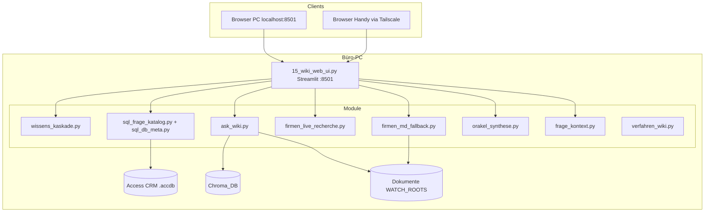
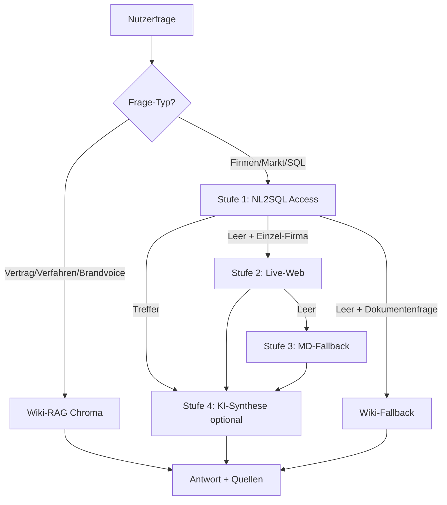

# DigiWiki – Technische Zusammenhänge

**Stand:** Juni 2026  
**Zielgruppe:** Administrator, Entwickler, technische Schulung

---

## 1. Systemüberblick

DigiWiki ist eine **lokale Streamlit-Anwendung** auf dem Büro-PC. Sie verbindet:

- **Access-CRM** (strukturierte Firmen-/Personen-/Produktdaten)
- **ChromaDB** (Vektor-Suche in Dokumenten)
- **Gemini / GPT** (Embeddings, Wiki-Antworten, NL2SQL, KI-Synthese)
- **Tailscale** (Remote-Zugang vom Handy)

Es gibt **keine Cloud-Instanz** der App — Handy und PC greifen auf denselben PC-Server zu.

---

## 2. Kernmodule und Aufgaben

| Modul | Aufgabe |
|-------|---------|
| `15_wiki_web_ui.py` | Streamlit-UI: Chat, Mails, Agenda, Routing, Export |
| `config.py` | Pfade, Env-Variablen, Wissensbereiche, Chroma-Filter |
| `sql_frage_katalog.py` | 11 SQL-Fragetypen, semantische Aliase, Direkt-SQL |
| `sql_db_meta.py` | Tabellenrollen + JOIN-Graph aus CSV |
| `frage_kontext.py` | Gesprächskontext: Firma, kundennumm, Thema, Region |
| `wissens_kaskade.py` | Auto-Routing: wann SQL / Wiki / Kaskade |
| `ask_wiki.py` | Chroma-RAG + Gemini-Antwort |
| `verfahren_wiki.py` | Direktpfad Einrichtung + Schulung (ohne Chroma-Rauschen) |
| `brandvoice.py` | Brandvoice-Dokumente direkt lesen |
| `firmen_live_recherche.py` | Stufe 2: Live-Website per Playwright |
| `firmen_md_fallback.py` | Stufe 3: MD `{kundennumm}_*.md` gezielt |
| `orakel_synthese.py` | Stufe 4: KI-Briefing aus SQL + Stamm + Web + MD |
| `9_wiki_waechter.py` | Index-Wartung: neue Docs, CRM-MD bereinigen |
| `antworten_export.py` | Markierte Q&A → Markdown in `Antworten/` |

---

## 3. Datenfluss: Nutzerfrage (Auto-Modus)

### Stufe 1 – SQL

- Klassifikation: `klassifiziere_chat_frage()` → GPT-4o-mini
- Direkt-SQL ohne LLM: Folgefragen mit `kundennumm`, Produktfragen (`abdaartikel` JOIN)
- NL2SQL: Schema + `data_dictionary.csv` + `db_tabellen/joins/spalten.csv`
- Ausführung: pyodbc → Access

**Wichtige JOINs:**

| Frage | Tabellen | Verknüpfung |
|-------|----------|-------------|
| Person bei Firma | `crm_personen` ↔ `stammdatenindustrie` | `kundennumm` |
| GF / Hierarchie | + `ref_funktionen` | `funktionid` |
| Produkte / Artikel | `abdaartikel` ↔ `stammdatenindustrie` | `anbieter_nr` = `anbieternummer` |
| Top-Produkte (Freitext) | nur `stammdatenindustrie` | `topprodukte`, `gl_produkt1–3` |

### Stufe 2 – Live-Web

- Modul: `firmen_live_recherche.py`
- URL aus CRM: `aktuelle_haupt_url`, `internetadresse`, `gl_web`
- Cache: `live_web_cache.json` (TTL 7 Tage)
- Optional: Personen → `crm_personen` (GF aus Impressum)

### Stufe 3 – MD-Fallback

- Modul: `firmen_md_fallback.py`
- Nur `{kundennumm}_*.md` unter `...\MD\`
- **Nicht** in Chroma — direkter Dateizugriff
- CRM-MD (~4200 Dateien) aus Standard-Wiki ausgeschlossen

### Stufe 4 – KI-Synthese

- Modul: `orakel_synthese.py`
- Kombiniert: SQL-Ergebnis + Stammfelder + ArtikelDB-Stichprobe + Web/MD
- GPT-4o-mini → strukturiertes Briefing (C-Level)

### Wiki-RAG (eigener Pfad)

- Chroma + Gemini Embeddings (`gemini-embedding-2`)
- Standard-Filter: **ohne** `bereich=crm_archiv`
- Verfahren: Direktpfad `DIGIBEST\Einrichtung + Schulung` vor Chroma
- Brandvoice: eigener Direktpfad

---

## 4. Gesprächskontext (Folgefragen)

Modul: `frage_kontext.py`

Nach SQL-/Web-Antworten speichert DigiWiki:

- `kundennumm`, Firmenname, Thema (produkte, narrativ, region …)
- Produktschwerpunkt, Region aus Stammfeldern
- Schluesselfakten für NL2SQL-Prompt

**Folgefragen** („Welche Produkte haben die?“) nutzen:

1. `baue_direkt_sql_folgefrage()` — sichere SQL-Vorlagen
2. `baue_sql_kontext_block()` — Pflicht-Filter `kundennumm`
3. Kein Personenname als Firmenfilter bei Firmenthemen

---

## 5. Wiki-Index (Chroma)

| Komponente | Datei / Pfad |
|------------|--------------|
| Vektordatenbank | `Chroma_DB/` (oder Env `DIGIWIKI_CHROMA_DB`) |
| Index-Stand | `wiki_stand.json` |
| Wächter | `9_wiki_waechter.py` (nightly Task) |
| Beobachtete Ordner | `WATCH_ROOTS` (Default: `C:\Eigene Projekte`, `C:\Verwaltung`) |
| CRM-MD Ausschluss | `CHROMA_EXCLUDE_CRM_MD=true`, `bereich=crm_archiv` |

**Aktiv vs. archiviert:**

- ~206 indexierbare Docs (Verfahren, Verträge, Brandvoice …)
- ~4200 CRM-Website-MD **nicht** im Standard-Index

---

## 6. Infrastruktur PC ↔ Handy

| Komponente | Rolle |
|------------|--------|
| Streamlit | Port **8501**, bindet `0.0.0.0` |
| Tailscale | Virtuelles Netz `100.x.x.x` |
| Handy-URL | `http://100.x.x.x:8501` (ohne DNS) |
| `digiwiki_helpers.ps1` | Watchdog: Tailscale + Streamlit-Health |
| `digiwiki_keepalive.ps1` | Task alle 5 Min: Reparatur |
| `start.bat` | Gesamtstart + Zugangsdaten |

Siehe: [DigiWiki_Verbindung_Einrichtung_Schulung.md](DigiWiki_Verbindung_Einrichtung_Schulung.md)

---

## 7. Konfiguration (`.env`)

| Variable | Default | Bedeutung |
|----------|---------|-----------|
| `DIGIWIKI_ACCESS_DB` | Pfad zur `.accdb` | CRM-Datenbank |
| `DIGIWIKI_CHROMA_EXCLUDE_MD` | `true` | CRM-MD nicht indexieren |
| `DIGIWIKI_ORAKEL_SYNTHESE` | `true` | KI-Briefing bei Firmenfragen |
| `DIGIWIKI_SINGLE_SESSION` | `false` | PC + Handy parallel |
| `DIGIWIKI_LIVE_WEB` | `true` | Live-Website Stufe 2 |
| `OPENAI_API_KEY` | — | NL2SQL, Klassifikator, Synthese |
| `GOOGLE_API_KEY` | — | Gemini Embeddings + Wiki |

---

## 8. Abhängigkeiten (Python `.venv`)

| Paket | Verwendung |
|-------|------------|
| `streamlit` | Web-UI |
| `langchain-google-genai` | Chroma + Wiki-LLM |
| `chromadb` | Vektordatenbank |
| `pyodbc` | Access |
| `openai` | NL2SQL, Synthese |
| `playwright` | Live-Web (optional) |
| `pandas` | SQL-Ergebnisse |

---

## 9. Metadaten für SQL (Relationsschicht)

| Datei | Inhalt |
|-------|--------|
| `db_schema.txt` | Rohes Access-Schema |
| `data_dictionary.csv` | Spalten-Lexikon |
| `db_tabellen.csv` | Tabellenrollen |
| `db_joins.csv` | JOIN-Graph |
| `db_spalten.csv` | Spalten mit `[SUCH]`-Tags |

Eingebunden in `uebersetze_frage_in_sql()` via `sql_db_meta.py`.

---

## 10. Verwandte Dokumente

| Dokument | Inhalt |
|----------|--------|
| [DigiWiki_Bedienungsanleitung_Komplett.md](DigiWiki_Bedienungsanleitung_Komplett.md) | Nutzer-Bedienung |
| [Roadmap_Wissens_Kaskade.md](Roadmap_Wissens_Kaskade.md) | Geplante Weiterentwicklung |
| [PROJEKT_STATUS.md](PROJEKT_STATUS.md) | Aktueller Softwarestand |
| [DigiWiki_Verbindung_Einrichtung_Schulung.md](DigiWiki_Verbindung_Einrichtung_Schulung.md) | PC/Handy-Einrichtung |
