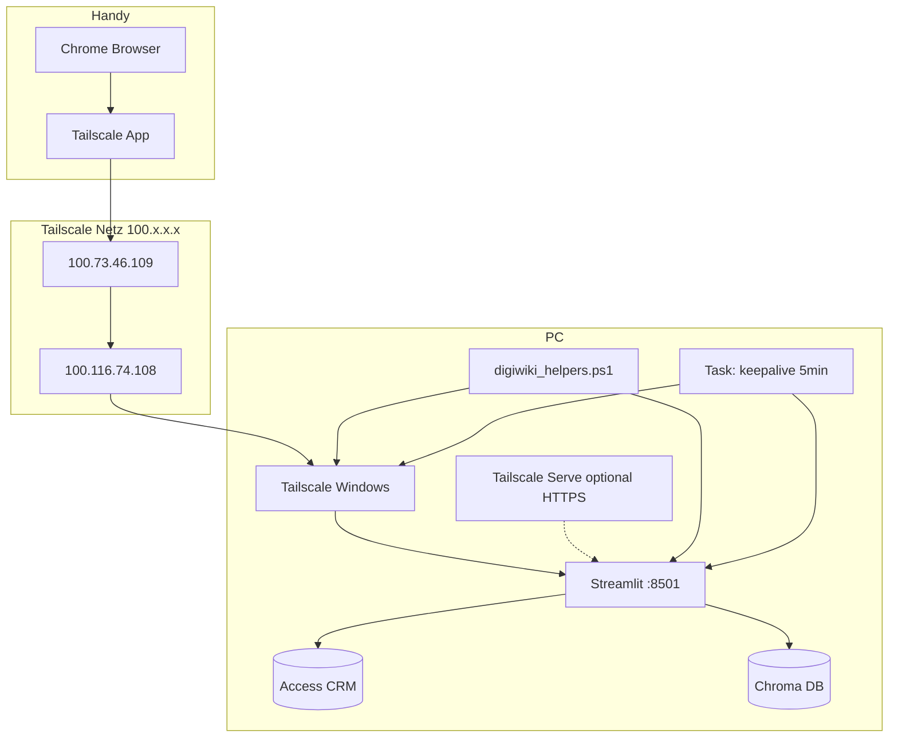

# DigiWiki – Verbindung, Einrichtung & Helferprogramme

**Stand:** Juni 2026  
**Projektordner:** `C:\Makroübungen\Digibest_Wiki_Projekt`  
**Zielgruppe:** Administrator (PC) und Nutzer (Handy) – Schulung & Einrichtung

> **Aktuelle URLs** werden beim Start automatisch in `digiwiki_zugang.txt` und `digiwiki_handy.html` geschrieben. Die Werte unten sind Beispiele vom Referenz-PC – nach Tailscale-Wechsel können sich IP/Hostname ändern.

---

## 1. Kurzüberblick

DigiWiki läuft **auf dem Büro-PC** (Streamlit, Port 8501). Das Handy ist **nur Browser** – keine eigene App, keine Cloud.

```
Handy (Chrome)  →  Tailscale-App (grün)  →  Tailnet  →  PC (Streamlit + CRM)
```

| Komponente | Rolle |
|------------|--------|
| **Streamlit** (`15_wiki_web_ui.py`) | Web-Oberfläche, Port **8501** |
| **Tailscale** | Sicheres Netz zwischen PC und Handy (IPs `100.x.x.x`) |
| **Access-CRM** | Datenbank lokal auf dem PC |
| **Chroma / Wiki-Index** | Dokumenten-Suche, lokal auf dem PC |

**Wichtig:** PC muss **eingeschaltet** sein und DigiWiki **laufen**. Handy allein reicht nicht.

---

## 2. Zugangs-URLs (Referenzstand)

| Nutzung | URL | Wann |
|---------|-----|------|
| **PC lokal** | `http://localhost:8501` | Am Schreibtisch am PC |
| **Handy (empfohlen)** | `http://100.116.74.108:8501` | Tailscale verbunden – **kein DNS nötig** |
| **Handy optional** | `https://desktop-velbert.tail094343.ts.net` | Nur wenn Tailscale-DNS am Handy aktiv |
| **WLAN (ohne Tailscale)** | `http://192.168.x.x:8501` | Nur im **gleichen** WLAN wie der PC |

### Handy-Lesezeichen (Standard)

```
http://100.116.74.108:8501
```

- **`http://`** (nicht https)
- **`:8501`** am Ende nicht vergessen
- **Nicht** die `.ts.net`-Adresse, wenn der Browser „Adresse nicht gefunden“ meldet

---

## 3. Benötigte Software

### PC (Windows)

| Programm | Zweck | Download / Hinweis |
|----------|--------|-------------------|
| **Python 3.11+** (im Projekt: `.venv`) | Laufzeit | Bereits im Projekt unter `.venv\Scripts\python.exe` |
| **Tailscale** | Remote-Zugang Handy ↔ PC | https://tailscale.com/download/windows |
| **Microsoft Access ODBC-Treiber** | CRM-Abfragen | Access / Office oder ODBC-Treiber |
| **Google Chrome** (empfohlen) | Lokale Bedienung | Optional |
| **Playwright + Chrome** | Live-Web-Recherche (Firmen) | `install_firmen_live.bat` |

### Handy (Android / iPhone)

| App | Zweck |
|-----|--------|
| **Tailscale** | Verbindung zum PC-Tailnet |
| **Chrome oder Firefox** | DigiWiki im Browser öffnen |

**Tailscale-Konto:** Derselbe Account auf **PC und Handy** (z. B. `ksbaufeldt@…`).

---

## 4. PC – Ersteinrichtung (einmalig)

Reihenfolge im Projektordner:

| Schritt | Datei | Wirkung |
|---------|-------|---------|
| 1 | `.venv` vorhanden prüfen | Python-Umgebung für DigiWiki |
| 2 | **`install_autostart.bat`** | Startet `start.bat` bei Windows-Anmeldung |
| 3 | **`install_keepalive_task.bat`** | Windows-Task: alle **5 Min** Verbindung prüfen/reparieren |
| 4 | **`install_desktop_verknuepfung.bat`** | Verknüpfung „DigiWiki starten“ auf dem Desktop |
| 5 | **`install_wiki_waechter_nacht.bat`** | Optional: Wiki-Index nightly (Task Scheduler 22:35) |

### `.env` (Projektroot, optional)

| Variable | Standard | Bedeutung |
|----------|----------|-----------|
| `DIGIWIKI_SINGLE_SESSION` | `false` | `true` = nur ein Gerät gleichzeitig (nicht empfohlen) |
| `DIGIWIKI_ORAKEL_SYNTHESE` | `true` | KI-Briefing bei Firmenfragen |
| `DIGIWIKI_CHROMA_EXCLUDE_MD` | `true` | CRM-Website-MD nicht im Wiki-Index |

---

## 5. PC – Täglicher Betrieb

### DigiWiki starten

| Datei | Beschreibung |
|-------|--------------|
| **`start.bat`** | **Hauptstart:** bereinigt alte Prozesse, Tailscale-Fix, Streamlit, Browser, schreibt `digiwiki_zugang.txt` |
| **`digiwiki_run_streamlit.bat`** | Nur Streamlit im sichtbaren Fenster (Debug) |

Nach `start.bat`:
- Streamlit läuft **im Hintergrund** (Port 8501)
- PC-Browser öffnet `http://localhost:8501`
- Handy-URLs stehen in **`digiwiki_zugang.txt`**

### Wenn das Handy plötzlich „nicht erreichbar“ ist

| Datei | Beschreibung |
|-------|--------------|
| **`digiwiki_handy_reparieren.bat`** | Tailscale prüfen, Zugangsdaten aktualisieren, Streamlit neu starten |
| **`start.bat`** erneut | Repariert auch bei „läuft bereits“ (Keepalive) |

**Log prüfen:** `digiwiki_keepalive.log` (im Projektordner) – zeigt automatische Reparaturen.

---

## 6. Helferprogramme im Projektordner

### Start & Betrieb (PC)

| Datei | Typ | Aufgabe |
|-------|-----|---------|
| `start.bat` | Batch | Gesamtstart: Cleanup, Tailscale, Streamlit, Helfer, Zugangsdaten |
| `digiwiki_start_streamlit.ps1` | PowerShell | Streamlit einmalig im Hintergrund starten |
| `digiwiki_start_helper.ps1` | PowerShell | Startet **einen** Hintergrund-Watchdog |
| `digiwiki_helpers.ps1` | PowerShell | Dauer-Watchdog: Tailscale, Streamlit-Health, SleepGuard |
| `digiwiki_keepalive.ps1` | PowerShell | **Einmal-Check:** Tailscale online? Streamlit healthy? → ggf. Neustart |
| `digiwiki_install_keepalive_task.ps1` | PowerShell | Legt Windows-Task „DigiWiki Keepalive“ an (alle 5 Min) |
| `digiwiki_cleanup.ps1` | PowerShell | Beendet alte DigiWiki-/Streamlit-Prozesse |
| `digiwiki_tailscale_fix.ps1` | PowerShell | Tailscale-Dienst, Serve (HTTPS), Firewall, RouteAll-Fix |
| `digiwiki_write_zugang.ps1` | PowerShell | Schreibt `digiwiki_zugang.txt` + `digiwiki_handy.html` |
| `digiwiki_netz_diag.ps1` | PowerShell | Netzwerk-Diagnose (`-Fix` = Auto-Reparatur) |
| `digiwiki_warte_port.ps1` | PowerShell | Wartet bis Port 8501 antwortet |
| `digiwiki_port_frei.ps1` | PowerShell | Prüft ob Port 8501 frei/belegt |
| `digiwiki_start_lock.ps1` | PowerShell | Verhindert parallele Start.bat-Läufe |

### Installation (einmalig)

| Datei | Aufgabe |
|-------|---------|
| `install_autostart.bat` | Task: DigiWiki bei Windows-Login |
| `install_keepalive_task.bat` | Task: Keepalive alle 5 Minuten |
| `install_desktop_verknuepfung.bat` | Desktop-Verknüpfung |
| `install_wiki_waechter_nacht.bat` | Task: Wiki-Wächter nachts |
| `install_firmen_live.bat` | Playwright/Chrome für Live-Web |

### Reparatur & Diagnose

| Datei | Aufgabe |
|-------|---------|
| `digiwiki_handy_reparieren.bat` | Handy-Verbindung: Status + Reparatur + Checkliste |
| `firmen_live_test.bat` | Test Live-Website-Recherche |
| `sql_regression_test.bat` | Test SQL-Routing |

### Zugangsdateien (automatisch gepflegt)

| Datei | Inhalt |
|-------|--------|
| `digiwiki_zugang.txt` | Alle URLs + Checkliste (Text) |
| `digiwiki_handy.html` | Einfache Link-Seite fürs Handy |

### Konfiguration Streamlit

| Datei | Inhalt |
|-------|--------|
| `.streamlit\config.toml` | Port 8501, CORS, WebSocket, `runOnSave=false` |

---

## 7. Windows-Hintergrunddienste (Tasks)

| Task-Name | Anlage | Intervall | Funktion |
|-----------|--------|-----------|----------|
| **DigiWiki Streamlit** | `install_autostart.bat` | Bei Anmeldung | Führt `start.bat` aus |
| **DigiWiki Keepalive** | `install_keepalive_task.bat` | Alle **5 Min** | `digiwiki_keepalive.ps1 -Quiet` |
| **DigiWiki Wiki-Wächter** | `install_wiki_waechter_nacht.bat` | Täglich 22:35 | Wiki-Index aktualisieren |

Tasks anzeigen: `taskschd.msc` → nach „DigiWiki“ suchen.

---

## 8. Handy – Einrichtung (Schulung)

### Einmalig

1. **Tailscale** installieren und mit **demselben Konto** wie der PC anmelden.
2. **Android – Privates DNS:** Einstellungen → Netzwerk → Privates DNS → **Aus**
3. **Android – Akku:** Einstellungen → Apps → Tailscale → Akku → **Uneingeschränkt**
4. **Chrome:** Lesezeichen anlegen mit  
   `http://100.116.74.108:8501`  
   (aktuelle IP aus `digiwiki_zugang.txt` auf dem PC)

### Jedes Mal vor der Nutzung

```
1. Tailscale-App öffnen → „Verbunden“ (grün)
2. Chrome öffnen → Lesezeichen „DigiWiki“
3. Warten bis Eingabefeld sichtbar → Frage stellen
```

**Exit Node in Tailscale:** **None** – das ist korrekt, nichts ändern.

**Melding „über Tailscale mit dem Internet verbunden“:** Normal – bedeutet Tailnet aktiv, **kein** Extra-Knopf nötig.

### Was nicht funktioniert

| Situation | Grund | Lösung |
|-----------|--------|--------|
| „Adresse nicht gefunden“ bei `https://…ts.net` | Kein Tailscale-DNS im Browser | IP-URL `http://100.x.x.x:8501` nutzen |
| Nur **Vorschau**, kein Tippen | Link-Vorschau (WhatsApp/Google) | URL **in Chrome** eintippen |
| Seite lädt kurz, dann Timeout | WebSocket / PC-Schlaf / Tailscale | PC: `start.bat` oder Keepalive abwarten |
| PC aus / Streamlit aus | Kein Server | PC an, `start.bat` |

---

## 9. Architektur (Detail)



---

## 10. Stabilität – was wir gegen Ausfälle eingebaut haben

| Problem (früher) | Lösung (heute) |
|------------------|----------------|
| Streamlit hängt, Port noch offen | Health-Check `/_stcore/health` → Neustart |
| Tailscale am PC offline nach Sleep | Keepalive + Helper: `tailscale up` / Fix-Skript |
| `start.bat` bei „läuft bereits“ ohne Reparatur | Ruft jetzt `digiwiki_keepalive.ps1` auf |
| Handy vs. PC Session-Kampf | Single-Session standard **aus** |
| `.ts.net`-URL auf Android | IP-URL als Standard in `digiwiki_zugang.txt` |

---

## 11. Schnell-Checkliste Administrator

- [ ] Tailscale am PC: Dienst **Automatisch**, online
- [ ] `install_autostart.bat` ausgeführt
- [ ] `install_keepalive_task.bat` ausgeführt
- [ ] `start.bat` einmal nach Updates
- [ ] `digiwiki_zugang.txt` an Nutzer weitergegeben
- [ ] Handy: Privates DNS **Aus**, Tailscale Akku **Uneingeschränkt**
- [ ] Handy-Lesezeichen: **IP-URL** mit `:8501`

---

## 12. Verwandte Dokumente

| Dokument | Inhalt |
|----------|--------|
| [Anleitung_Nutzer_Handy.md](Anleitung_Nutzer_Handy.md) | Nutzer: Handy Schritt für Schritt |
| [Anleitung_PC_und_Handy_Einrichtung_Admin.md](Anleitung_PC_und_Handy_Einrichtung_Admin.md) | Admin: ausführliche Ersteinrichtung |
| [Anleitung_Nutzer_Bedienung.md](Anleitung_Nutzer_Bedienung.md) | Bedienung DigiWiki |
| [Anleitung_Nutzer_Kurzreferenz.md](Anleitung_Nutzer_Kurzreferenz.md) | Spickzettel |

---

*Bei IP- oder Hostname-Änderungen: am PC `start.bat` oder `digiwiki_handy_reparieren.bat` ausführen – `digiwiki_zugang.txt` wird automatisch aktualisiert.*
