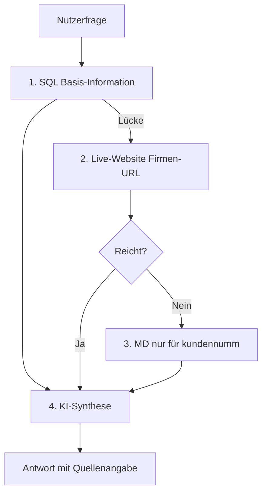

# DigiWiki – Roadmap: Wissens-Kaskade

**Stand:** Juni 2026  
**Ziel:** Firmen- und Marktfragen zuverlässig beantworten — ohne dauerhafte Abhängigkeit von veralteten MD-Website-Archiven.

**Verwandte Dokumente:**
- [Wiki_Lueckenanalyse.md](Wiki_Lueckenanalyse.md) – Ist-Analyse Wiki vs. SQL
- [PROJEKT_TODO.md](PROJEKT_TODO.md) – laufende technische Aufgaben
- [PROJEKT_STATUS.md](PROJEKT_STATUS.md) – Softwarestand

---

## 1. Ausgangslage

### Problem

| Befund | Folge |
|--------|--------|
| ~4.200 CRM-MD-Dateien sind **Website-Scrapes** (HTML/JS) | Chroma-Index verstopft; Wiki-Antworten kommen aus Rauschen |
| MD-Archive **altern** — Inhalte werden nicht automatisch aktualisiert | Antworten können veraltet sein |
| SQL-Datenbank ist **reich** (Firmen, Personen, Strategie, Produkte) | Viele Fragen gehören in SQL, landen aber im Wiki |
| Auto-Modus heute: **SQL → Wiki-RAG (gesamt)** | Kein Live-Web; MD nicht gezielt, sondern per Vektor-Suche |

### Erkenntnis

MD-Dateien sind **Offline-Rohmaterial**, kein dauerhaftes Wissensfundament. Sinnvoll als **letzter Fallback** — hinter SQL und **Live-Website**.

Die Tabelle **`md_personen_abgleich`** (Access) dient der **Veredelung** (MD → CRM), nicht der Live-Antwort-Engine.

---

## 2. Ziel-Architektur: Vier-Stufen-Kaskade

### Reihenfolge (verbindlich)

| Stufe | Quelle | Rolle | Aktualität |
|-------|--------|-------|------------|
| **1** | **SQL** (Access-CRM) | Strukturierte Basis: Stamm, Personen, Sortiment, Strategie-Felder, CRM-Aktivität | Hoch (manuell/Apollo gatlas gepflegt) |
| **2** | **Live-Website** (Firmen-URL aus DB) | Aktuelle Texte: Impressum, GF-Zitate, Sortiment, News | **Live** |
| **3** | **MD-Archiv** (nur `{kundennumm}_*.md`) | Offline-Fallback wenn Web blockiert / unvollständig | Niedrig (Snapshot) |
| **4** | **KI-Aufbereitung** (Gemini/GPT) | Synthese aus allen verfügbaren Kontexten + Quellenhinweise | — |

### Was **nicht** mehr Standard sein soll

- Globale Chroma-Suche über **alle** CRM-MD-Dateien bei Firmenfragen
- MD als **primäre** Quelle für Marktteilnehmer-Infos (GF, Strategie, Sortiment)

### Was im Wiki-RAG **bleibt**

- Verfahren, Verträge, Brandvoice, DigiBest-interne Docs
- Alles unter `WATCH_ROOTS`, **ohne** CRM-Website-MD-Ordner im Standard-Index

---

## 3. Ist vs. Soll

| Komponente | Stand Juni 2026 | Soll (Rest) |
|------------|-----------------|-------------|
| Auto-Routing | ✅ SQL → Web → MD → KI (`wissens_kaskade.py`) | Regressionstest-Matrix erweitern |
| Firmen-URL | ✅ Playwright bei Lücken (`firmen_live_recherche.py`) | `web_cache` in Access statt JSON |
| MD-Nutzung | ✅ Gezielt per `kundennumm`; CRM-MD aus Chroma | Wächter-Lauf für vollständige Bereinigung |
| KI-Synthese | ✅ `orakel_synthese.py` (Produkte, Briefings) | Alle Firmen-Fragetypen |
| Personen aus MD | Tabelle `md_personen_abgleich` vorhanden | Auto-Import / UI „In CRM übernehmen“ |
| Wiki-RAG | ✅ Verfahren-Direktpfad, CRM-MD ausgeschlossen | Kuratierte Docs in `DIGIBEST\Wiki\` |
| Produktsuche | ✅ `abdaartikel` via `anbieternummer` | — |
| Folgefragen | ✅ `frage_kontext.py` + Direkt-SQL | — |

---

## 4. Technische Bausteine

### Stufe 1 – SQL (vorhanden)

- `15_wiki_web_ui.py`: NL2SQL, `db_tabellen.csv`, `db_joins.csv`, `db_spalten.csv`
- Bei Firmenfragen: SQL liefert Daten **und** `kundennumm` + URL-Felder für Stufe 2

### Stufe 2 – Live-Website (✅ umgesetzt)

**Modul:** `firmen_live_recherche.py`

| Aspekt | Lösung |
|--------|--------|
| Browser | **Playwright** (Chromium) auf Windows-PC |
| URL | `COALESCE(aktuelle_haupt_url, internetadresse, gl_web)` aus `stammdatenindustrie` |
| Extraktion | Lesbarer Text (HTML → Text, JS-Seiten rendern) |
| Cache | `live_web_cache.json` (TTL 7 Tage) — **Migration nach Access `web_cache` offen** |
| TTL | z. B. 7 Tage — gleiche Firma nicht bei jeder Frage neu scrapen |
| UI | Spinner: „Live-Recherche auf Firmen-Website …“ (5–15 s) |

**Randbedingungen:** Cookie-Banner, Rate-Limits, robots.txt; Fehler → Stufe 3.

### Stufe 3 – MD-Fallback (✅ umgesetzt)

**Modul:** `firmen_md_fallback.py`

- Pfad: `C:\Eigene Projekte\MD\{kundennumm}_*.md`
- **Kein** Chroma; max. 1–1,5 MB lesen, relevante Abschnitte extrahieren
- Nur wenn Stufe 1 + 2 die Frage nicht beantworten

### Stufe 4 – KI-Synthese (✅ Basis umgesetzt)

- Ein Prompt: Frage + SQL-Ergebnis (JSON/Tabelle) + Web-Text + MD-Ausschnitt
- Ausgabe: strukturiertes Briefing (C-Level), **Quellen blockweise** (SQL / Web / MD)
- Modell: bestehend Gemini 2.5 Flash / GPT-4o mini

---

## 5. Index-Hygiene (parallel)

| Maßnahme | Zweck |
|----------|--------|
| CRM-MD-Ordner aus Standard-Chroma **ausschließen** | Wiki-RAG entlasten |
| `WATCH_ROOTS` optional ohne `...\MD\` | Keine Re-Indexierung alter Scrapes |
| Kuratierte Docs in `DIGIBEST\Wiki\` | Verfahren, Glossar, Leistungen (siehe Lückenanalyse §6) |

---

## 6. Umsetzungs-Roadmap

### Phase A – Kaskaden-Router ✅ erledigt

**Ziel:** Auto-Modus folgt SQL → Web → MD → KI statt SQL → Wiki-RAG.

- [x] Neues Modul `wissens_kaskade.py` mit Orchestrierung
- [x] `15_wiki_web_ui.py`: Auto-Pfad anbinden; Label „Auto (SQL → Web → MD → KI)“
- [x] Firmenfrage erkennen (`kundennumm` / Firmenname aus SQL oder Frage)
- [x] Wiki-RAG nur noch für explizit dokumentenbezogene Fragen (Verträge, Verfahren, Brandvoice)
- [ ] Testfragen-Matrix (20 Fragen aus Lückenanalyse §8) — Regression erweitern

**Erfolgskriterium:** ✅ Firmenfrage „Briefing Hexal“ liefert SQL + optional Web — **nicht** CRM-MD-Rauschen aus Chroma.

---

### Phase B – Live-Web + Cache ⚠️ größtenteils erledigt

**Ziel:** Stufe 2 produktiv.

- [x] `playwright` in venv + `playwright install chromium`
- [x] `firmen_live_recherche.py`: URL laden, Text extrahieren, Fehlerbehandlung
- [ ] Access-Tabelle `web_cache` anlegen (aktuell: `live_web_cache.json`)
- [x] Konfiguration in `config.py`: TTL, Timeout, Max-Bytes
- [x] Batch-Datei `firmen_live_test.bat` für Einzeltests

**Erfolgskriterium:** ⚠️ Live-Web funktioniert; GF-Abgleich mit `md_personen_abgleich` noch manuell.

---

### Phase C – MD gezielt + Chroma bereinigen ✅ erledigt

**Ziel:** MD nur noch Fallback; Index sauber.

- [x] Gezielter MD-Loader per `kundennumm` (`firmen_md_fallback.py`)
- [x] CRM-MD aus Chroma entfernen / Metadaten `bereich=crm_archiv` ohne Standard-Suche
- [x] Wiki-Wächter: `bereinige_crm_archiv_aus_index()` + `CHROMA_EXCLUDE_CRM_MD`
- [x] Doku in Nutzer-Anleitung: „Marktdaten = Auto/SQL“

**Erfolgskriterium:** ✅ Index-Filter aktiv; vollständiger Wächter-Lauf optional (~4200 Entfernungen).

---

### Phase D – Veredelung & optionaler Import (mittelfristig)

**Ziel:** Erkenntnisse zurück in CRM.

- [ ] Aus `web_cache` / Live-Recherche: neue Personen → Vorschlag für `crm_personen`
- [ ] Aus `md_personen_abgleich`: manueller oder halbautomatischer Import
- [ ] UI: „In CRM übernehmen“ für `abgleich_status = nur_in_md`
- [ ] Audit-Felder: `quelle`, `geprueft_am`

---

## 7. Konfiguration (umgesetzt in `config.py`)

| Variable / Setting | Default | Bedeutung |
|------------------|---------|-----------|
| `DIGIWIKI_MD_ORDNER` | `C:\Eigene Projekte\MD` | MD-Fallback-Pfad |
| `DIGIWIKI_WEB_CACHE_TTL_DAYS` | `7` | Cache-Gültigkeit |
| `DIGIWIKI_WEB_TIMEOUT_S` | `30` | Playwright-Timeout |
| `DIGIWIKI_KASKADE_WEB` | `true` | Stufe 2 ein/aus |
| `DIGIWIKI_KASKADE_MD` | `true` | Stufe 3 ein/aus |
| `DIGIWIKI_CHROMA_EXCLUDE_MD` | `true` | CRM-MD nicht indexieren |

---

## 8. Risiken & Mitigation

| Risiko | Mitigation |
|--------|------------|
| Web-Scraping langsam | Cache (`web_cache`); async Spinner; TTL |
| Pharma-Seiten blockieren Bot | Playwright mit echtem Browser; User-Agent; Impressum-Pfade |
| Falsche MD-Extrakte | MD nur Fallback; `md_personen_abgleich` manuell prüfen |
| Doppelte KI-Kosten | Erst SQL; Web nur bei Lücke; Cache |
| Tailscale-Nutzer warten auf PC | Live-Recherche läuft auf Host-PC — akzeptabel für internes Tool |

---

## 9. Entscheidungen (festgehalten)

1. **SQL ist die Basis** für Markt- und Firmenwissen.
2. **MD-Files nicht dauerhaft** als Wissensquelle — nur Fallback + Veredelungs-Queue.
3. **Live-Website** vor MD — aktuellere Informationen.
4. **KI am Ende** — eine zusammenhängende Antwort mit Quellen.
5. **Wiki-RAG** bleibt für **Dokumenten-Wissen** (Verfahren, Verträge, Brandvoice).

---

## 10. Nächste Schritte (offen)

| Priorität | Aufgabe |
|-----------|---------|
| 🔴 | `web_cache` in Access statt JSON-Datei |
| 🔴 | KI-Synthese für alle Firmen-Fragetypen (nicht nur Produkte/Briefing) |
| 🟡 | Phase D: Personen aus Web/MD → CRM-Vorschlag + UI |
| 🟡 | Regressionstest-Matrix (20 Wiki- + 20 Kaskaden-Fragen) |
| 🟡 | `data_dictionary.csv` bereinigen, `abdaartikel` vollständig |
| 🟢 | Kuratierte Docs unter `DIGIBEST\Wiki\` |
| 🟢 | Render-Deployment (optional, persistent storage nötig) |

Siehe auch: [PROJEKT_TODO.md](PROJEKT_TODO.md) · [DigiWiki_Technische_Zusammenhaenge.md](DigiWiki_Technische_Zusammenhaenge.md)

---

*Erstellt im Rahmen der Wiki-Lückenanalyse und MD-Personen-Abgleichs (`md_personen_abgleich.py`).*
