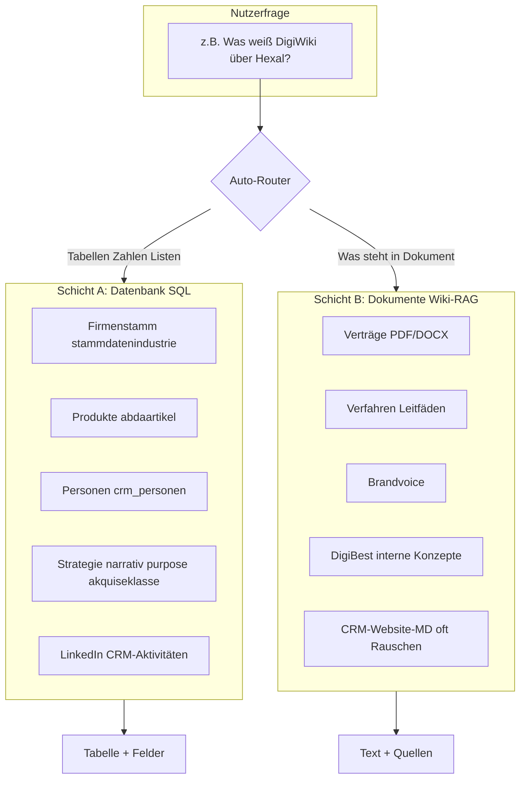

# DigiWiki – Lückenanalyse Wissensbasis (Wiki vs. SQL)

**Stand:** Juni 2026  
**Ziel:** Schwachstellen im Wiki aufspüren und klären, **was** an Wissensbasis fehlt – im Vergleich zu dem, was bereits in der **SQL-Datenbank** liegt.

---

## 1. Kurzfassung (Executive Summary)

| Befund | Bedeutung |
|--------|-----------|
| **~96 % der Wiki-Dateien sind CRM-Website-Archive** (4.156 `.md` mit Kundennummer im Namen) | Vektor-Suche wird **verstopft**; Antworten kommen oft aus **HTML-Müll**, nicht aus Ihrem Business-Wissen |
| **Nur ~28 echte Markdown-Dokumente** + 125 Word/PDF außerhalb dieser CRM-Exporte | Das **qualitative Firmenwissen** (DigiBest, Verfahren, Strategie) ist im Wiki **dünn** |
| **SQL-Datenbank ist reich** (Marktteilnehmer, Produkte, Strategie-Felder, CRM) | Viele „Business“-Fragen gehören **in den SQL-Modus**, nicht ins Wiki |
| **Wiki und SQL sind nicht dasselbe** | Lücke entsteht, wenn man vom Wiki eine **Gesamt-Auskunft** erwartet, die eigentlich **SQL + Dokumente** bräuchte |

**Kernproblem:** Nicht nur „zu wenig Dokumente“, sondern **falsche Erwartung + verzerrter Index**.

---

## 2. Zwei Wissensschichten – wer beantwortet was?



### Schicht A – SQL (strukturiert, aktuell, quantitativ)

**Stärken:** Marktteilnehmer, Kontakte, Produkte, Segmente, Scores, Listen, Vergleiche.

| Thema | Tabellen | Beispielfragen |
|-------|----------|----------------|
| Firmen & Adressen | `stammdatenindustrie` | Adresse von Klosterfrau, Firmen in Köln |
| Strategie & Profil | `stammdatenindustrie` (narrativ, purpose, ambition, …) | Narrativ von Bayer, D2P-Score, Akquiseklasse |
| Sortiment & Produkte | `stammdatenindustrie`, `abdaartikel` | Top-Produkte Sanofi, wer stellt X her |
| Personen & Hierarchie | `crm_personen`, `ref_funktionen` | Wer ist GF bei Hexal? |
| Apotheken | `stammdatenapo` | Apotheken in München |
| CRM-Aktivität | `crm_aktivitaeten`, Trigger-Historie | Letzter LinkedIn-Post, Trigger-Events |
| Whitelist | `Whitelist_Kontakte` | Freigegebene Kontakte Priorität hoch |

→ **Das ist Ihr Business-Rückgrat.** Hier fehlt weniger Wissen, eher **Routing und Formulierung** (Nutzer wählen Wiki statt SQL).

### Schicht B – Wiki (unstrukturiert, narrativ, qualitativ)

**Stärken:** Verträge, Abläufe, Formulierungen, interne Entscheidungen, lange Texte.

| Thema | Soll-Inhalt | Ist-Stand (Index) |
|-------|-------------|-------------------|
| Verfahren / Abläufe | MSV, Akquise, Bestellablauf, interne Prozesse | **~1–21** Dateien (wenig, verstreut) |
| Verträge / Rechtliches | AV-Verträge, Kundenverträge, AGB | **~8** |
| Brandvoice / Kommunikation | Hans, DigiBest | **~32** DOCX ✅ |
| DigiBest Produkt & Positionierung | Leistungen, USP, Pricing-Logik | **~88** Dateien, gemischt (Rechnungen, PDFs, wenig strukturiert) |
| Markt-/Branchenwissen | Pharma-Vertrieb, Entscheider-Verhalten | **Einzelne** MD (Social Media, Marketing-Strategie) |
| CRM-Firmenarchive | Website-Scrapes | **~4.156** MD ⚠️ **Qualitätsproblem** |

---

## 3. Ist-Zustand Index (Messwerte)

Aus `wiki_stand.json` (ca. 4.345 indexierte Dateien):

| Kategorie | Anzahl | Anteil | Bewertung |
|-----------|--------|--------|-----------|
| CRM-MD (`5000…_Firma.md`) | ~4.156 | ~96 % | ⚠️ Rauschen, HTML-Scrapes |
| Sonstige MD | ~28 | <1 % | ✅ relevant, aber wenig |
| DOCX (inkl. Brandvoice) | ~125 | ~3 % | ✅ teils wertvoll |
| PDF | ~27 | <1 % | ✅ Verträge, teils wertvoll |
| TXT/CSV | ~9 | <1 % | neutral |

**Beispiel CRM-MD (Hexal):** Datei beginnt mit Website-HTML/JavaScript – **kein** strukturiertes Firmenprofil aus der DB.

**Folge:** Frage *„Erzähl mir über Hexal“* im **Wiki-Modus** → Treffer aus **Website-Müll**, nicht aus `narrativ`/`purpose` in SQL.

---

## 4. Lücken-Matrix nach Business-Bereich

Legende: ✅ gut abgedeckt · 🟡 teilweise · 🔴 Lücke · ➡️ eher SQL als Wiki

| Business-Bereich | SQL | Wiki | Lücke / Handlung |
|------------------|-----|------|------------------|
| **Marktteilnehmer-Stamm** (Name, Adresse, Segment) | ✅ | ➡️ | Wiki nicht nötig; SQL-Modus nutzen |
| **Strategie pro Firma** (Narrativ, Purpose, Ambition) | ✅ Felder in DB | 🔴 | In **DB**, nicht in sauberen Docs; Wiki-Fragen führen in die Irre |
| **Produkte / Sortiment / PZN** | ✅ | ➡️ | SQL; Wiki nur für Produkt-**Beschreibungen** wenn vorhanden |
| **Ansprechpartner / GF / Hierarchie** | ✅ | ➡️ | SQL |
| **Apothekenmarkt** | ✅ | 🟡 | SQL stark; Wiki: Apotheken-**Playbooks** fehlen |
| **Akquise & Marktbearbeitung** (Klassen, D2P) | ✅ | 🔴 | **Methodik** fehlt: Was bedeutet AK 3? Wie nutze ich D2P? → **Dokumente schreiben** |
| **DigiBest Leistungen** (MSV, Bestelloptimierung, …) | 🟡 | 🟡 | Einzelne Drehbücher/Verträge indexiert; **kein** zentrales Produkt-Wiki |
| **Vertrieb & Akquise-Prozess** | 🔴 | 🔴 | Kein durchgängiges Verfahren im Index |
| **Verträge & Recht** | 🔴 | 🟡 | Wenige PDFs; nicht systematisch |
| **Interne Strategie DigiBest** | 🔴 | 🟡 | Marketing-MD vorhanden; **Geschäftsstrategie** nicht als Wiki-Kern |
| **Kommunikation / Tonalität** | 🔴 | ✅ | Brandvoice gut (eigene Route) |
| **Projekt- & Kundenhistorie** | 🟡 Trigger/CRM | 🟡 | Strukturiert in DB; **Projektberichte** als Docs oft fehlend |
| **Branchen-/Marktstudien** | 🔴 | 🟡 | Einzelne MD; nicht kuratiert |
| **Schulung / Onboarding** | 🔴 | 🔴 | Fehlt |
| **Entscheidungsregeln** („Wann AK 1 vs. 3?“) | 🔴 | 🔴 | **Explizites Regelwerk** fehlt – weder DB noch Wiki |

---

## 5. Typische Fehl-Erwartungen (Warum Wiki „Lücken“ hat)

| Nutzer fragt | Erwartung | Realität | Richtige Route |
|--------------|-----------|----------|----------------|
| *„Gib mir einen Überblick über Hexal“* | Fließtext-Briefing | Wiki findet HTML-MD | **SQL:** narrativ, purpose, topprodukte, akquiseklasse … |
| *„Welche Firmen passen zu unserem ICP?“* | Analyse | Wiki kann das nicht | **SQL** + ggf. feste Regeln dokumentieren |
| *„Was ist unsere Vorgehensweise bei AK 2?“* | Prozess | Nicht in DB | **Wiki-Dokument** fehlt → anlegen |
| *„Was steht im Vertrag mit Curaden?“* | Klausel | In PDF (wenn indexiert) | **Wiki** + ggf. Vertragsordner prüfen |
| *„Wie formulieren wir ein Angebot?“* | Brandvoice | Brandvoice-DOCX | **Wiki** (Brandvoice-Route) ✅ |

---

## 6. Priorisierte Inhalts-Roadmap (Was fehlt im Wiki)

### 🔴 Priorität 1 – Grundlagen (maximaler Nutzen)

Diese Dokumente **existieren in SQL nicht** als Prozess/Wissen:

| # | Dokument (Vorschlag) | Inhalt | Ablage |
|---|----------------------|--------|--------|
| 1 | **DigiBest_Leistungsuebersicht.md** | MSV, Bestelloptimierung, Module, USP, Zielgruppe | `C:\Eigene Projekte\DIGIBEST\Wiki\` |
| 2 | **Akquiseklassen_Leitfaden.md** | Was bedeutet AK 1–4, wann welche Bearbeitung | intern |
| 3 | **Marktsegmente_Glossar.md** | Marktzielgruppe, emarktzielgruppe, funktion vs. Personen-Rolle | intern |
| 4 | **D2P_und_Veredelung.md** | Scores interpretieren, wann relevant | intern |
| 5 | **Vertriebsprozess_Standard.md** | Von Recherche → Kontakt → Angebot (Ihr Ablauf) | intern |

### 🟡 Priorität 2 – Vertiefung

| # | Dokument | Inhalt |
|---|----------|--------|
| 6 | Apotheken-Ansprache Playbook | Wie Apotheken segmentieren und ansprechen |
| 7 | Wettbewerb & Positionierung DigiBest | Abgrenzung, Argumente |
| 8 | FAQ intern | Wiederkehrende Fragen + Antworten |
| 9 | Projekt-Templates | Was nach Kundengespräch dokumentiert wird |
| 10 | Vertrags-Index | Liste wichtiger Verträge + Pfad (Meta-Dokument) |

### 🟢 Priorität 3 – Optional

- Schulungsunterlagen Onboarding  
- Meeting-Protokoll-Vorlage + Ablageordner  
- Branchenstudien (kuratiert, nicht rohe Scrapes)

---

## 7. Technische Schwachstellen (Index & Routing)

| Problem | Auswirkung | Maßnahme (Vorschlag) |
|---------|------------|----------------------|
| **4.156 CRM-MD im gleichen Index** | Wiki-Antworten aus Rauschen | CRM-MD **aus RAG ausschließen** oder eigenen Bereich `crm_archiv` ohne Standard-Suche |
| **Auto-Router → Wiki bei leerem SQL** | Irreführende Quellen | OK für Fallback; bei Firmenfragen **SQL bevorzugen** (Klassifikator schärfen) |
| **Kein Hybrid-Antwortmodus** | „Gesamtüberblick Firma X“ braucht DB + Docs | Mittelfristig: **Kombi-Antwort** (SQL-Felder + optionale Docs) |
| **Wissensbereich-Filter** | CRM-MD oft `vollzugriff` | Beim Indexieren CRM-MD als `datenbank` oder quarantäne |
| **Datei_Index-Tabelle** | Verknüpft Firmen ↔ Dateien | Nutzen: „Welche Docs hat Firma X?“ – evtl. SQL-Feature |

---

## 8. Audit-Checkliste – 20 Testfragen

Zum systematischen Testen: Frage stellen → Modus **Auto** und **Wiki** vergleichen → Ergebnis eintragen.

### Sollte **SQL** liefern (Wiki darf nicht „Lücke“ simulieren)

| # | Testfrage | SQL ok? | Wiki fälschlich? | Notiz |
|---|-----------|---------|------------------|-------|
| 1 | Was ist das Narrativ von Hexal? | | | |
| 2 | Marktzielgruppe von Bayer | | | |
| 3 | Top-Produkte von Sanofi | | | |
| 4 | Wer ist GF bei [Firma]? | | | |
| 5 | Firmen in Akquiseklasse 3 mit Apotheken-Fokus | | | |
| 6 | D2P-Score und Begründung von [Firma] | | | |
| 7 | Wie viele ABDA-Artikel hat [Firma]? | | | |
| 8 | Adresse und Website von Klosterfrau | | | |

### Sollte **Wiki** liefern (echte Dokumenten-Lücken)

| # | Testfrage | Antwort ok? | Quelle sinnvoll? | Fehlt Dokument? |
|---|-----------|-------------|------------------|-----------------|
| 9 | Was bietet DigiBest an (Leistungsübersicht)? | | | |
| 10 | Wie läuft unser Bestellablauf ab? | | | |
| 11 | Was steht im AV-Vertrag / Kundenvertrag [X]? | | | |
| 12 | Wie gehen wir mit Akquiseklasse 2 um (Prozess)? | | | |
| 13 | Brandvoice Hans zu Emotionalität | | | |
| 14 | Unsere Positionierung gegenüber Wettbewerbern | | | |
| 15 | Was bedeutet D2P für unsere Beratung? | | | |

### Grenzfälle (Hybrid gewünscht)

| # | Testfrage | Ideal | Aktuell |
|---|-----------|-------|---------|
| 16 | Vollständiges Briefing Firma X für Gespräch | SQL + Docs + Kontakte | ? |
| 17 | Warum ist Firma X AK 3? | DB-Feld + interne Regel-Doc | ? |
| 18 | Welche Unterlagen haben wir zu Firma X? | Datei_Index + Ordner | ? |
| 19 | Letzte Aktivität + strategische Einordnung | CRM + narrativ | ? |
| 20 | Gesamtüberblick Apothekenmarkt DigiBest | SQL + Playbook | ? |

---

## 9. Empfohlener Arbeitsplan (4 Phasen)

### Phase A – Klarheit (1–2 Tage)

- [ ] Diese Matrix mit echten Testfragen (§8) durchspielen  
- [ ] Festlegen: **Welche Fragen sind SQL, welche Wiki** (Team-Regel)  
- [ ] Nutzer-Anleitung ergänzen: „Marktdaten = Datenbank-Modus“

### Phase B – Index-Hygiene (technisch, 1 Tag)

- [ ] CRM-Website-MD aus Standard-Wiki-Suche nehmen  
- [ ] Oder: Ordner `C:\Eigene Projekte\MD\` aus Watch-Roots entfernen / quarantäne  
- [ ] Wiki-Wächter neu laufen lassen  
- [ ] Erneut Testfragen §8

### Phase C – Inhalte Priorität 1 (laufend)

- [ ] 5 Kern-Dokumente aus §6 anlegen (Markdown reicht)  
- [ ] In `C:\Eigene Projekte\DIGIBEST\Wiki\` oder `C:\Verwaltung\Wiki\` ablegen  
- [ ] Indexieren + erneut testen

### Phase D – Produkt-Verbesserung (mittelfristig)

- [ ] Klassifikator: Firmen-/Strategie-Fragen → SQL  
- [ ] Optional: „Firmen-Briefing“-Button (SQL-Bundle)  
- [ ] `Datei_Index` in UI nutzbar machen

---

## 10. Ordner-Empfehlung für neues Wiki-Wissen

```
C:\Eigene Projekte\DIGIBEST\Wiki\
├── 01_Unternehmen\          # Leistungen, Strategie DigiBest
├── 02_Verfahren\            # Vertrieb, Akquise, MSV-Abläufe
├── 03_Glossar\              # AK, Segmente, D2P, Begriffe
├── 04_Vertraege\            # (oder Verweis auf bestehende Vertragsordner)
└── 05_FAQ\
```

Alles unter `WATCH_ROOTS` → wird automatisch indexiert.

---

## 11. Fazit

| Frage | Antwort |
|-------|---------|
| **Ist das Wiki „schlecht“?** | Für **Dokumenten-Wissen** ok, aber **überschattet** von CRM-Archiven |
| **Fehlt Business-Wissen?** | In **SQL nein** – in **Prozess-/Methoden-Docs ja** |
| **Größte Lücke?** | **DigiBest-interne Playbooks** + **Interpretations-Wissen** (Was bedeutet AK/D2P?) |
| **Größter technischer Hebel?** | **CRM-MD aus Wiki-RAG raus** + **SQL für Marktdaten** |

---

*Nächster Schritt empfohlen: Phase A (20 Testfragen) gemeinsam auswerten – daraus entsteht die konkrete To-do-Liste für Phase B + C.*
